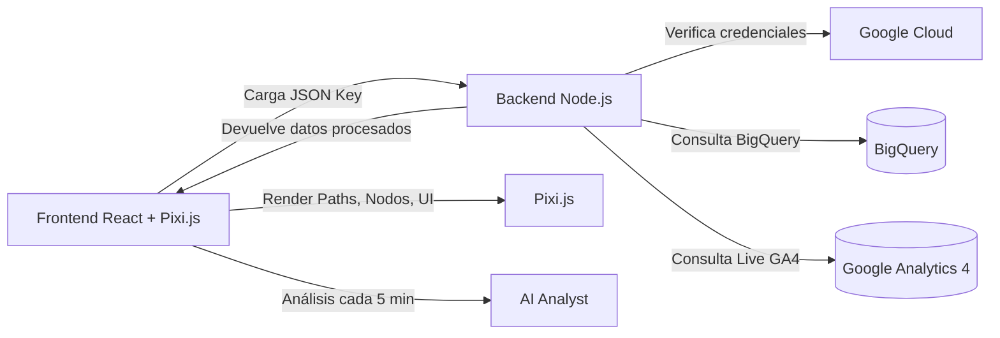

# Visualizador de Flujo de Usuarios

Este documento describe la arquitectura, el concepto y la implementación del sistema de visualización interactiva de flujo de usuarios basado en **Node.js**, **React**, **Pixi.js**, **Google Analytics 4 (GA4)** y **BigQuery**.

Incluye:

* Concepto general del sistema
* Arquitectura técnica
* Flujo de datos
* Especificación por secciones del gráfico
* Requerimientos técnicos
* Pseudocódigo de implementación
* Tecnologías utilizables
* Lista de tareas (TODO list) para la IA implementadora

---

# 1. Concepto General

El objetivo del sistema es visualizar de forma interactiva el **flujo histórico y en vivo de usuarios** dentro de un sitio web.

El gráfico funciona como un **mapa de navegación horizontal**, donde cada etapa del journey del usuario se representa en **columnas**, y cada página o grupo de páginas se representa como un **nodo**.

Entre los nodos se dibujan **líneas (line paths)** cuyo grosor representa el porcentaje del tráfico que fluye entre ellos.

Además:

* Los **nodos son clicables** → al hacer clic se abre un **panel HTML** con detalles jerárquicos del nodo.
* El gráfico usa **Pixi.js** para renderizar nodos, líneas y partículas animadas que simulan tráfico en vivo.
* Los datos provienen de **BigQuery (históricos)** y de **Google Analytics 4 (live data)**.
* La página permite **cargar un JSON Key de Google Cloud** para acceder a las APIs.
* El sistema simula ser real‑time aunque las actualizaciones reales ocurren cada **5 minutos**.
* Un panel inferior muestra análisis automatizados realizados por una IA.

---

# 2. Arquitectura Técnica



---

# 3. Flujo del Sistema

1. El usuario carga su **JSON Key**.
2. El backend valida credenciales, detecta **Property ID** y disponibilidad de datos.
3. El backend ejecuta:

   * consultas históricas a BigQuery
   * consultas live a GA4
4. Procesa y normaliza los datos:

   * nodos
   * conexiones
   * porcentajes
   * bouncing rate
   * conversiones
5. El frontend recibe:

   * datos históricos
   * datos live
6. Pixi.js dibuja:

   * nodos
   * line paths
   * partículas animadas (tráfico vivo)
7. La interfaz HTML muestra:

   * panel de detalles por nodo
   * panel de IA
   * barras de progreso de actualización

---

# 4. Secciones del Gráfico y sus Funciones

## 4.1. Sección de Adquisición (Acquisition)

Representa el origen del usuario:

* Google Ads
* Orgánico
* Redes Sociales
* Email
* Etc.

Cada nodo incluye datos:

* % de tráfico total
* Distribución por región (top 5)
* Dispositivos
* Edad / Género
* Nuevos vs recurrentes
* Campañas (si aplica)

## 4.2. Páginas de Entrada

Nodos agrupados por URL o categoría:

* Home
* Landing pages
* Product pages
* Promo pages
* Otros (top 20)

Cada nodo permite abrir detalles:

* top términos de búsqueda
* top productos visitados
* productos visitados sin agregar al carrito
* productos agregados pero no comprados

## 4.3. Carrito → Checkout

Incluye:

* embudo de conversión
* bouncing rate por paso
* revenues
* datos live estimados

## 4.4. Panel de IA

La IA analiza:

* picos de tráfico
* problemas (ej: checkout lento)
* anomalías
* campañas que mejor convierten
* cambios de tendencia durante el día

---

# 5. Backend (Node.js)

## Funciones principales

* Validar JSON Key
* Descubrir Property ID
* Chequear disponibilidad de datasets
* Consultar BigQuery
* Consultar GA4 Live
* Normalizar datos para el frontend

### Pseudocódigo (simplificado)

```js
app.post('/upload-key', async (req, res) => {
  const key = req.body.jsonKey;

  const client = new GoogleClient(key);
  const properties = await client.getAnalyticsProperties();

  res.json({ properties });
});
```

```js
app.get('/historical', async (req, res) => {
  const sql = `SELECT * FROM dataset.events WHERE event_date >= ...`;
  const rows = await bigQueryClient.query(sql);
  const graphData = parseHistorical(rows);
  res.json(graphData);
});
```

```js
app.get('/live', async (req, res) => {
  const liveReport = await ga4.runRealtimeReport({ ... });
  res.json(processLive(liveReport));
});
```

---

# 6. Frontend (React + Pixi.js)

## Renderizado de nodos

```js
function createNode(node) {
  const gfx = new PIXI.Graphics();
  gfx.beginFill(node.color);
  gfx.drawCircle(0, 0, node.size);
  gfx.endFill();

  gfx.interactive = true;
  gfx.on('pointerdown', () => openInfoPanel(node));

  return gfx;
}
```

## Renderizado de paths

```js
function drawPath(from, to, percentage) {
  const line = new PIXI.Graphics();
  line.lineStyle(Math.max(1, percentage * 10), 0xffffff, 0.4);
  line.moveTo(from.x, from.y);
  line.lineTo(to.x, to.y);
  return line;
}
```

## Partículas de tráfico vivo

```js
function spawnParticle(path) {
  const dot = new PIXI.Graphics();
  dot.beginFill(path.color);
  dot.drawCircle(0, 0, 3);

  animateParticle(dot, path);
  return dot;
}
```

## Panel de detalles (HTML)

```jsx
function InfoPanel({ node }) {
  return (
    <div className="panel">
      <h2>{node.label}</h2>
      <p>Total tráfico: {node.percent}%</p>
      <DetailsTree data={node.details} />
    </div>
  );
}
```

---

# 7. Tecnologías y Herramientas

### Backend

* Node.js
* Express
* Google Analytics Data API
* BigQuery API
* JWT Service Accounts

### Frontend

* React
* Pixi.js
* Zustand o Redux para estados
* TailwindCSS para el panel HTML

### Infraestructura

* GCP (si se despliega allí)
* Cloud Run u otro hosting

### Metodologías

* Data caching cada 5 minutos
* Normalización de nodos en un grafo
* Sistema de eventos para refrescar solo lo necesario

---

# 8. TODO LIST (Estado Actualizado)

## 🔧 Backend

* [x] Implementar carga y validación del JSON Key
* [x] Detectar Property ID automáticamente
* [x] Comprobar disponibilidad de BigQuery
* [x] Crear consultas históricas base
* [x] Crear consultas live GA4
* [x] Normalizar datos en nodos + paths
* [x] Crear endpoint `/api/start-historical-job`
* [x] Crear endpoint `/api/realtime`
* [x] Implementar modo debug con auto-login
* [x] Crear endpoint `/api/inspect-data` para metadatos
* [x] Implementar sistema de tokens temporales (1 hora)
* [x] Agregar endpoints de verificación de propiedades
* [x] Implementar detección automática de datasets y propiedades GA4
* [x] Crear endpoint `/api/monthly-dashboard` con fallback BigQuery → GA4
* [ ] Implementar caching de 5 minutos

## 🎨 Frontend (React + TypeScript)

* [x] Crear layout principal con React
* [x] Implementar componente SankeyCanvas
* [x] Dibujar nodos con SVG
* [x] Dibujar paths (Sankey diagram)
* [x] Implementar selector de Property ID
* [x] Implementar panel lateral de detalles
* [x] Crear árbol jerárquico de datos por nodo
* [x] Implementar visualización de demografía (Age, Gender, Device, Location)
* [x] Agregar información de ventas estimadas
* [x] Implementar bloques informativos estilo "mindmap" en canvas
* [x] Mostrar Property URL y "Mes en curso" en header
* [x] Implementar panel de "Resumen de Audiencia"
* [x] Agregar gráficos de barras para demografía
* [x] Localización completa en español
* [ ] Implementar partículas de tráfico vivo animadas
* [ ] Crear barra de progreso de actualización
* [ ] Optimizar layout para evitar solapamiento de nodos

## 🌐 Localización

* [x] Traducir toda la interfaz al español
* [x] Traducir fuentes de tráfico (Orgánico, Redes Sociales, Campañas Ads)
* [x] Traducir dispositivos (Móvil, Escritorio, Tablet)
* [x] Traducir géneros (Hombre, Mujer, Desconocido)
* [x] Agrupar páginas con nombres en español (Inicio, Productos, Blog, etc.)

## 🤖 IA Analyst

* [ ] Analizar datos cada 5 min
* [ ] Detectar anomalías
* [ ] Sugerir insights
* [ ] Registrar historial de insights

## 📦 Mejoras Pendientes

* [ ] Implementar sistema de caching en backend
* [ ] Agregar animaciones de partículas para tráfico en vivo
* [ ] Mejorar algoritmo de layout para datasets complejos
* [ ] Agregar métricas de tasa de conversión
* [ ] Implementar exportación de datos a CSV/PDF
* [ ] Agregar filtros por rango de fechas personalizado
* [ ] Implementar comparación de períodos
* [ ] Agregar tests unitarios y de integración
* [ ] Optimizar rendimiento para grandes volúmenes de datos

## 🐛 Bugs Conocidos

* [x] Error 500 en `/api/start-historical-job` - **RESUELTO** (sintaxis BigQuery corregida)
* [ ] Posible solapamiento de nodos en datasets muy grandes
* [ ] Lint warnings en server.js (línea 480) - requiere revisión

## 📝 Documentación

* [x] README principal con arquitectura
* [x] README de nueva arquitectura React
* [ ] Documentación de API endpoints
* [ ] Guía de deployment
* [ ] Guía de configuración de debug mode

